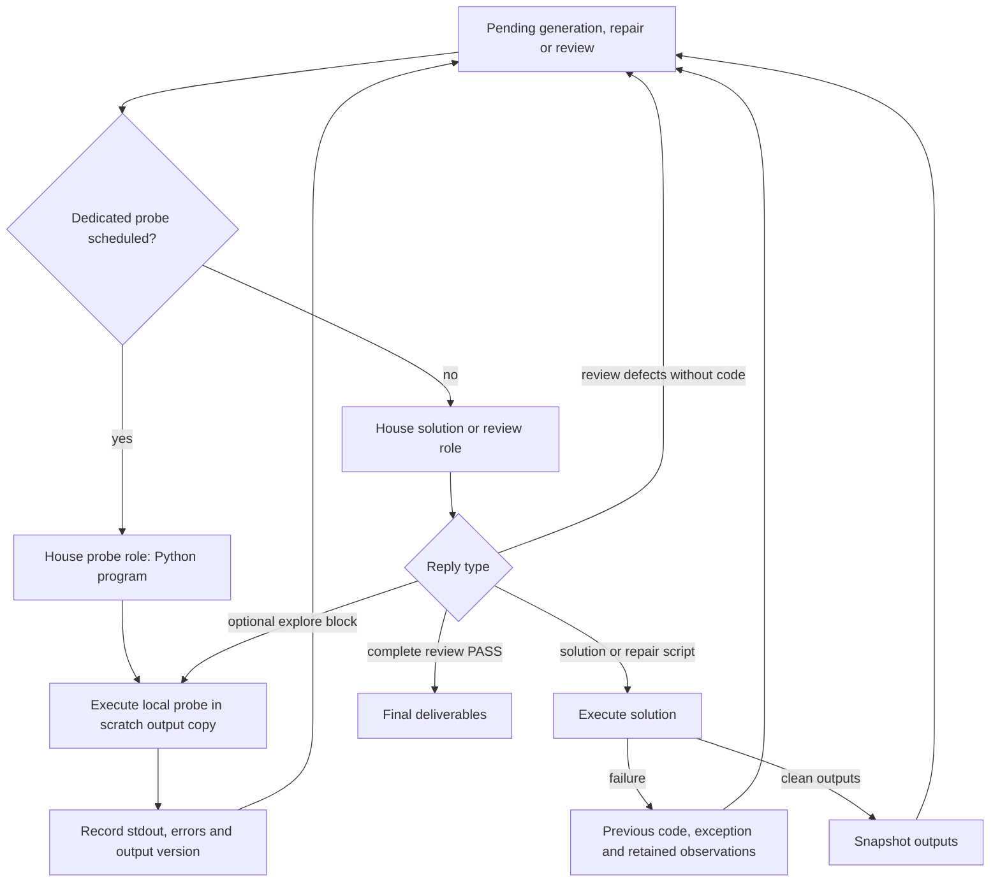

# Execution feedback

The entrant can run local probes and repair scripts inside one `solve` invocation. The final
deliverables are graded once after the agent exits. Internal House calls and script executions
consume the same request and runtime budgets; the official checker supplies no feedback to this
loop.



Probe observations are required task context in all prompt variants. A probe requested during
repair or review returns to that pending operation, retaining its previous code, error, verdict
state and edit base. A response containing both a probe and a proposed decision runs the probe
first while affordable; the next model response makes the decision with the observations.

The initial measurement and an output measurement before review are explicit House `probe`
requests while allowance and follow-up budget remain. Their system prompt asks only for a small
diagnostic program in a Python fence. Routing uses this requested phase, so a Python-formatted
probe cannot enter deliverable validation or solution cleanup. In ordinary requests, Python
blocks remain solutions/fixes and an `explore` block explicitly requests an optional probe.

Each probe gets a fresh copy through `OUTPUT_DIR`. Its results name the phase and solution turn
they inspected. Earlier observations remain historical evidence after edits; they are not a
validation of newly generated outputs. The prompt asks the model to check the task's definitions,
compare independently calculated and observed numbers, and print the discrepancy. A probe's
claim of success is not an official verdict.

Truncated probes, including responses with an early closed block, do not execute. A dedicated
probe gets one recovery request, then resumes the pending operation without fabricated evidence.
Probes cannot become solution continuations. Tool exhaustion asks the model to finish its pending operation;
deadline or request exhaustion retains the last clean snapshot when one exists. Its correctness
still depends on the offline checker.

## Reproduced defects

Five failures were reproduced on synthetic tasks with a recorded model client and real local
Python execution, then fixed:

- Observations were appended only to the immediate generation prompt. Repair and review rebuilt
  the original task prompt and lost them. Observations now travel in every task-prompt variant.
- The dispatcher accepted probes only during generation. A review probe was treated as a missing
  verdict and a repair probe as missing code. Both now execute and resume their original phase.
- Probe extraction preceded the truncation check. A closed early probe in a token-limited reply
  executed despite incomplete generation. Such responses now return to the pending operation.
- Repeated failures were compared using the final variable-dump line. Different locals hid the
  same exception, and identical locals falsely equated different exceptions. The signature now
  uses the exception tail before the structured error context.
- Python-formatted probes entered the solution branch: an initial probe could become final
  output, and a review probe lost its input outputs to solution cleanup. Probe requests now have
  a dedicated role and routing phase that accepts Python programs and resumes the pending operation.

The regression command exercises numerical evidence retention, context reduction, copied-output
inspection, assertion feedback, repair/review resumption, truncation, continuation, exhaustion,
and repeated exceptions:

```bash
.venv/bin/python -m pytest -q -p no:cacheprovider tests/test_agent_evidence.py
```

## Experiment

Keep `AGENT_EXPLORE` off by default until measured. Compare `AGENT_EXPLORE=2` with `0`, using the
same committed image, units, budgets and simultaneous load, with at least two runs per arm.
Inspect whether probes perform numerical computations and read outputs; a pass-rate change
without those observations does not demonstrate that execution feedback helped. Record fixed
denominator pass@1, request/runtime costs, and the phases in which probes executed. Launch long
runs with `setsid nohup`; wait for prior cohorts to finish before adding model load.

The completed eight-unit pilot (`20261001-1056-probe-loop-*`) passed 3/16 with probes versus
4/16 for control. Its traces exposed an additional routing problem: all initial responses used
Python fences, including short programs explicitly labelled as probes. The dispatcher handled
them as solutions, so their observations did not enter the probe ledger. Only four review probes
executed across the 16 probe-arm units. The system's Python-only response instruction conflicted
with the user prompt's initial `explore` format. This pilot does not establish whether correctly
routed initial numerical probes help. The explicit request phase and separate role prompts above
fix that conflict; repeat the same matched pilot to measure the corrected loop.
